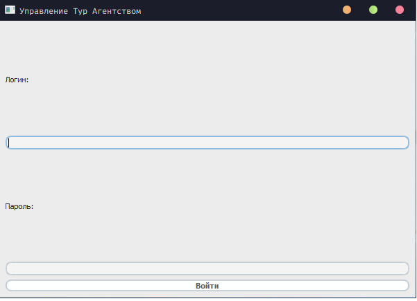
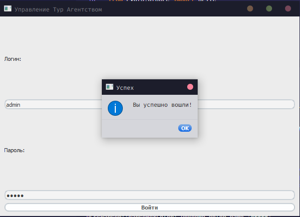
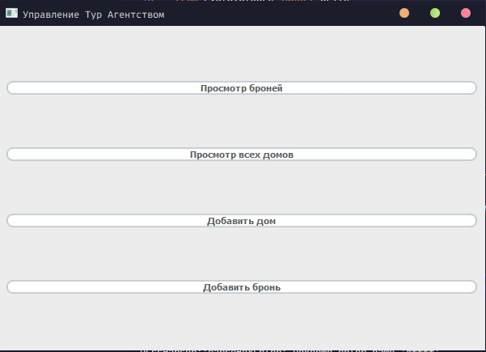
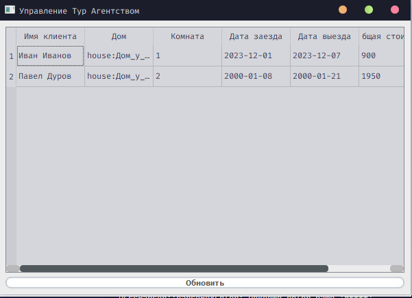
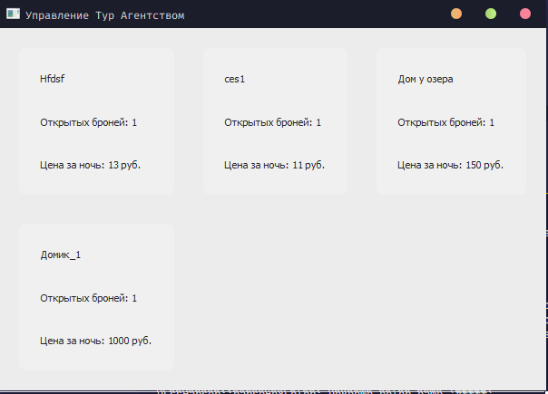
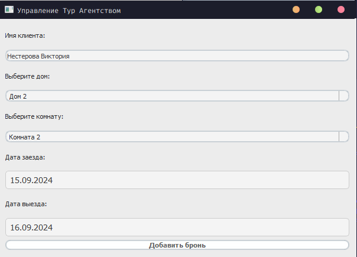
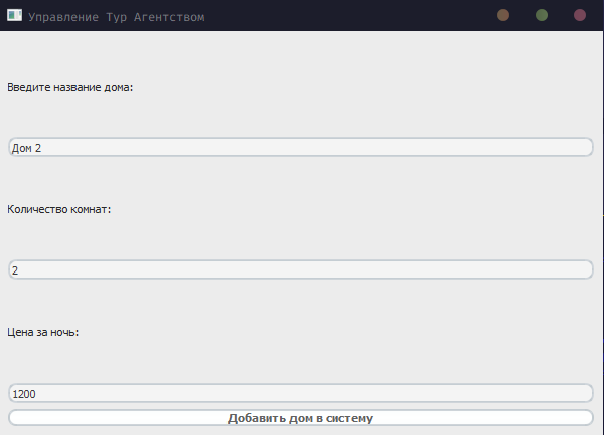

# Название проекта

Краткое описание вашего проекта и его назначения.

## Содержание
- [Описание](#описание)
- [Установка](#установка)
- [Использование](#использование)
- [Структура проекта](#структура-проекта)
- [Технологии](#технологии)
- [Пример использования](#пример-использования)

## Описание

Здесь можно подробно рассказать о функционале вашего приложения, его целях и особенностях.

## Установка

Установите npm-пакет с помощью команды:
```bash
   git clone https://github.com/Fairwell/nesterova-practics
```
2. Перейдите в директорию проекта:
```bash
   cd ваш_репозиторий
```
3. Установите зависимости:
```bash
   pip install -r req.txt
```
4. Настройте файл окружения `.env` (при необходимости).

## Использование

Опишите, как запустить приложение и его основные функции. Например:
```bash
python main.py
```

## Структура проекта
```js
├
├─ cmp/                      // Папка, где находятся классы компонентов приложения  
├    ├── BookingWindow.py    // Компонент добавления брони 
├    ├── HouseWindow.py      // Компонент добавления дома 
├    ├── AuthorizationWindow.py // Компонент авторизации 
├    └── ShowHouseWindow.py  // Компонент для показа всех домов 
├
├─ temp/                     // Папка, где находятся всякая всячина 
├    └── First_add_BD.py     // Добавление первых документов в базу данных 
├
├─ .env                      // Файл окружения с секретными переменными 
├
├─ .gitignore                // Файл для скрытия некоторых файлов/папок  
├
├─ main.py                   // Главный файл с приложением 
├
├─ req.txt                   // Файл с названиями библиотек для  `pip install -r req.txt`  
├
└─ stylesheet.qss            // Файл со стилями для приложения Qt5
```

## Технологии
### 1. PyQt5 
**PyQt5** — это библиотека для создания графических пользовательских интерфейсов (GUI) на языке Python. Она предоставляет набор инструментов и компонентов, которые позволяют разработчикам создавать кроссплатформенные приложения с использованием Qt, популярного фреймворка для разработки GUI. PyQt5 включает в себя виджеты, такие как кнопки, текстовые поля, метки и многое другое, а также поддержку событий и сигналов, что делает разработку интерфейсов более интуитивной и удобной. 
 
### 2. CouchDB 
**CouchDB** — это NoSQL база данных, которая использует документную модель хранения данных. Она позволяет хранить данные в формате JSON и предоставляет RESTful API для выполнения операций с данными. CouchDB поддерживает репликацию и управление версиями документов, что делает ее подходящей для распределенных систем и приложений, требующих высокой доступности данных. 
 
### 3. Requests 
**Requests** — это библиотека Python, предназначенная для упрощения работы с HTTP-запросами. Она позволяет легко отправлять GET и POST запросы, управлять заголовками, параметрами и данными, а также обрабатывать ответы от сервера. Requests делает работу с API более удобной и понятной, позволяя разработчикам сосредоточиться на бизнес-логике, а не на низкоуровневых деталях сетевого взаимодействия. 
 
### 4. JSON 
**JSON (JavaScript Object Notation)** — это формат обмена данными, который используется для представления структурированных данных. Он легковесен и легко читаем, что делает его популярным выбором для API и обмена данными между клиентом и сервером. В вашем коде JSON используется для передачи данных между приложением и CouchDB, а также для сериализации и десериализации данных. 
 
### 5. Qt Designer (опционально) 
Если вы использовали **Qt Designer** для создания интерфейсов, это инструмент для визуального проектирования GUI-приложений на основе Qt. Он позволяет создавать интерфейсы с помощью перетаскивания элементов, что упрощает процесс разработки и повышает продуктивность.

## Пример использования

<p align="center">
 <span>Окно авторизации</span>
   <br>
 
   <br>
 <span>Окно авторизации - Успех</span>
   <br>
 
   <br>
 <span>Главное окно</span>
   <br>
 
   <br>
 <span>Окно для просмотра брони</span>
   <br>
 
 <span>Окно для просмотра домов</span>
 
 <span>Окно добавления дома</span>
 
 <span>Окно добавления брони</span>
 
</p>
